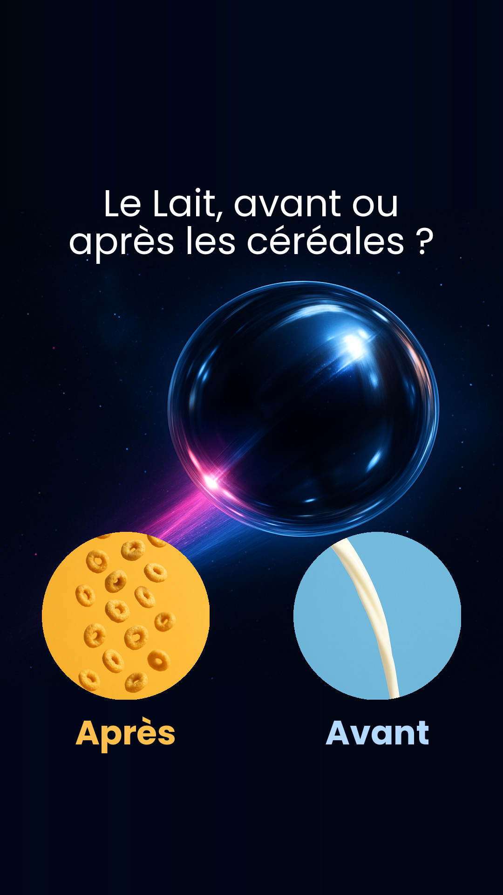
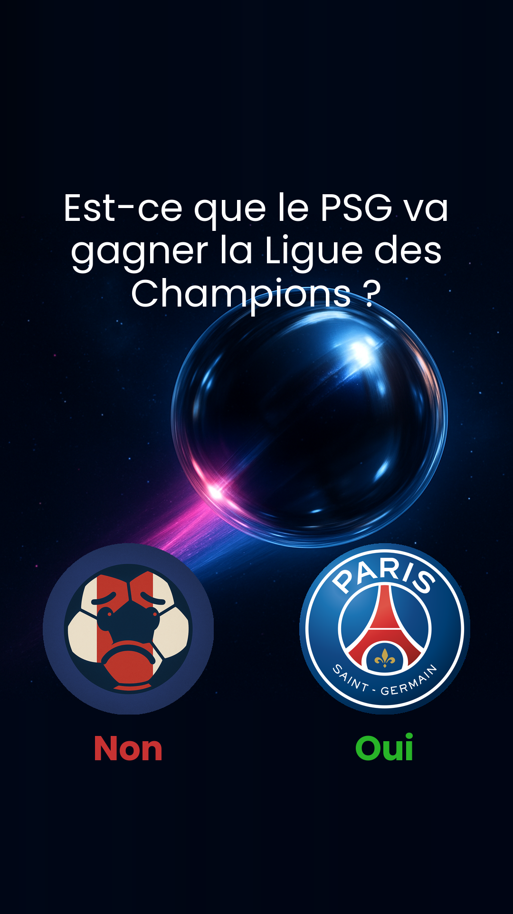

# 🎵 Simulation de Billes Musicale

Un simulateur de physique interactif qui transforme les collisions de billes en musique et en visualisations artistiques, spécialement conçu pour générer automatiquement des vidéos TikTok virales.

👉 Découvrez les résultats générés sur TikTok : [@nekoji.official](https://www.tiktok.com/@nekoji.official)

## 🌟 Fonctionnalités

- Simulation physique réaliste des billes avec Pygame et Pymunk
- Génération de musique en temps réel basée sur les collisions
- Visualisations artistiques dynamiques
- Système de particules interactif
- Gestion des obstacles et des cuves
- Interface utilisateur intuitive
- Génération automatique de vidéos TikTok avec thèmes viraux
- Système de questions/réponses interactif
- Génération automatique de miniatures personnalisées

## 🖼️ Exemples de Miniatures Générées

Voici deux exemples de miniatures générées automatiquement par le projet :

<p align="center">
  
  
</p>

Chaque miniature reprend la question du thème, les deux choix de réponses illustrés par des images, et un design optimisé pour TikTok.

## 🎬 Thèmes TikTok

Le projet inclut plusieurs thèmes viraux prêts à l'emploi dans le dossier `assets/themes/` :

- `celib/` : Questions sur le célibat
- `chien_chat/` : Préférences entre chiens et chats
- `debile/` : Questions humoristiques
- `ex/` : Questions sur les relations passées
- `ghost/` : Thème sur le ghosting
- `lait_cereales/` : Débat lait avant/après céréales
- `ldc_psg/` : Rivalité LDC vs PSG
- `manque/` : Questions sur le manque
- `message_ex/` : Messages d'ex
- `netflix/` : Questions sur les séries
- `pense/` : Questions de réflexion
- `pense_homme/` : Questions sur la pensée masculine
- `recevoir/` : Questions sur les cadeaux
- `semaine/` : Questions sur la semaine
- `tromperie/` : Questions sur la fidélité

### Structure d'un Thème

Chaque thème contient :
```
theme/
├── bg.png          # Image de fond
├── music.wav       # Musique de fond
├── non.png         # Image pour réponse négative
├── non.wav         # Son pour réponse négative
├── oui.png         # Image pour réponse positive
├── oui.wav         # Son pour réponse positive
└── question.wav    # Son de la question
```

## 🖼️ Génération de Miniatures

Le projet inclut un système de génération automatique de miniatures pour TikTok (`thumbnail.py`). Chaque miniature est générée avec :

- Format vertical optimisé pour TikTok (1080x1920)
- Question principale en haut
- Deux options de réponse avec leurs images respectives
- Effets visuels personnalisés :
  - Images circulaires avec masque
  - Texte avec effet de lueur
  - Police Poppins pour une meilleure lisibilité
  - Couleurs personnalisées pour chaque option
  - Texte centré et redimensionné automatiquement

Pour générer une miniature :
```bash
python thumbnail.py
```

La miniature sera sauvegardée dans le dossier `output/` avec le format `thumbnail-{THEME}.png`.

## 🛠️ Prérequis

- Python 3.8 ou supérieur
- pip (gestionnaire de paquets Python)

## 📦 Installation

1. Clonez le dépôt :
```bash
git clone https://github.com/votre-username/music.git
cd music
```

2. Créez un environnement virtuel Python :
```bash
python -m venv .venv
```

3. Activez l'environnement virtuel :
```bash
# Sur Windows
.venv\Scripts\activate
# Sur Linux/Mac
source .venv/bin/activate
```

4. Installez les dépendances :
```bash
pip install -r requirements.txt
```

## 🚀 Utilisation

Pour lancer la simulation :
```bash
python main.py
```

## 📁 Structure du Projet

```
music/
├── assets/          # Ressources graphiques et sonores
│   ├── themes/     # Thèmes TikTok prédéfinis
│   ├── fonts/      # Polices personnalisées
│   └── thumbnail/  # Ressources pour les miniatures
├── core/           # Cœur de la simulation
├── physics/        # Moteur physique
├── scenes/         # Différentes scènes de simulation
├── ui/             # Interface utilisateur
├── utils/          # Utilitaires
├── main.py         # Point d'entrée
├── thumbnail.py    # Générateur de miniatures
└── config.py       # Configuration
```

## 🎨 Personnalisation

Vous pouvez modifier les paramètres de la simulation dans `config.py` :
- Taille de la fenêtre
- Nombre de billes
- Propriétés physiques
- Paramètres audio
- Options de visualisation
- Configuration des thèmes TikTok :
  - Durée de la vidéo
  - Transitions entre scènes
  - Effets visuels
  - Paramètres audio
- Configuration des miniatures :
  - Couleurs des options
  - Taille des images
  - Effets visuels
  - Police et taille de texte

## 🙏 Remerciements

- Pygame pour le moteur graphique
- Pymunk pour la physique
- Tous les contributeurs du projet
